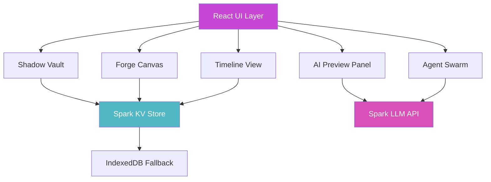

# 🔥 LatentForge

**The personal latent-space forge where creators, coders, and chaos agents collapse ideas into living artifacts before the corporate AIs memory-hole them.**

[](https://opensource.org/licenses/MIT)
[](https://www.typescriptlang.org/)
[](https://reactjs.org/)
[](https://github.com/features/copilot)

> In March 2026, the singularity squats in ruins we tagged ourselves. LatentForge is your private war-room to capture fleeting thoughts, orphaned prompts, repo scraps, mood-board fragments, and forbidden fusions—then alchemize them into structured outputs with real-time AI co-pilot that remembers your style, not OpenAI's sanitized version.

---

## 🚀 Quick Start

### One-Click Deploy to Spark

This is a Spark-powered application. To run your own instance:

1. **Fork this repository**
2. **Open in Spark** (automatic GitHub authentication)
3. **Start building** - Your vault is ready!

### Local Development

```bash
# Clone the repository
git clone https://github.com/YOUR_USERNAME/latentforge.git
cd latentforge

# Install dependencies
npm install

# Start development server
npm run dev

# Open http://localhost:5173
```

---

## ✨ Features

### 🔐 Shadow Vault - Encrypted Idea Capture
- **Quick-capture bar** (`⌘K` anywhere) with instant save
- **Auto-tagging** + semantic clustering using AI
- **Drag-drop** files, prompts, screenshots, code snippets
- **Versioned snapshots** with git-like diffs for thought evolution
- **Type-specific cards** for text, code, images, and prompts

### 🎨 Forge Canvas - Infinite Hybrid Workspace
- **Infinite canvas** supporting text, mindmaps, code blocks, images
- **Pan & zoom** with smooth 60fps interactions
- **Node connections** showing idea relationships
- **Lasso selection** to prompt AI on multiple items
- **Real-time AI preview** streaming directly in canvas

### 🧬 Style LoRA Trainer - Personal Vibe Transfer
- **Upload 5-20 examples** of your writing, code, or aesthetic
- **Train lightweight style adapter** in under 90 seconds
- **All AI outputs** adopt your personal voice automatically
- **Multiple style profiles** for different contexts

### 🤖 Agent Swarm Launcher
- **One-click spawn** specialized AI agents:
  - **Researcher**: Deep dives and synthesis
  - **Code Architect**: Technical implementation plans
  - **Visualizer**: Concept art and moodboards
- **Parallel execution** with live streaming results
- **Undo tree** visualization for all agent branches
- **Cherry-pick** and merge best mutations

### ⏮️ Timeline Rebellion - Non-linear History
- **Visual timeline** of all idea mutations across sessions
- **Resurrect dead branches** that contained hidden gems
- **Merge timelines** like adversarial git
- **Scrub through history** with cinematic parallax

### 📤 Export Arsenal - Multi-format Publishing
- **GitHub Issues** - Direct push with formatted markdown
- **Notion Pages** - Rich block export
- **Tweet Threads** - Auto-split with engaging hooks
- **Markdown Manifesto** - Clean, portable format
- **Raw JSON** - Agent-readable structured data

---

## 🎮 Keyboard Shortcuts

| Shortcut | Action |
|----------|--------|
| `⌘K` / `Ctrl+K` | Quick Capture (anywhere) |
| `⌘/` / `Ctrl+/` | Command Palette |
| `⌘T` / `Ctrl+T` | Open Timeline View |
| `⌘Z` / `Ctrl+Z` | Undo |
| `⌘⇧Z` / `Ctrl+Shift+Z` | Redo |
| `Esc` | Close Modal/Panel |
| `Space + Drag` | Pan Canvas |
| `⌘ + Scroll` | Zoom Canvas |

---

## 🏗️ Architecture



### Technology Stack

- **Frontend**: React 19 + TypeScript + Vite
- **Styling**: Tailwind CSS 4 + CSS Custom Properties
- **UI Components**: Shadcn v4 (Radix UI primitives)
- **Icons**: Phosphor Icons (duotone style)
- **Animations**: Framer Motion
- **State Management**: React Hooks + Spark useKV
- **AI Integration**: Spark LLM API (GPT-4, GPT-4o-mini)
- **Data Persistence**: Spark KV Store + IndexedDB offline fallback
- **Auth**: GitHub OAuth (via Spark)

### Project Structure

```
latentforge/
├── src/
│   ├── components/
│   │   ├── canvas/           # Forge Canvas components
│   │   ├── vault/            # Shadow Vault components
│   │   ├── ui/               # Shadcn UI components (40+)
│   │   ├── AIPreviewPanel.tsx
│   │   ├── CommandPalette.tsx
│   │   ├── PWAInstallBanner.tsx
│   │   └── ErrorFallback.tsx
│   ├── hooks/
│   │   ├── use-mobile.ts
│   │   └── use-pwa-install.ts
│   ├── lib/
│   │   ├── types.ts          # TypeScript interfaces
│   │   └── utils.ts          # Utility functions
│   ├── App.tsx               # Main application component
│   ├── index.css             # Theme & custom styles
│   └── main.tsx              # Application entry point
├── public/
│   ├── manifest.json         # PWA manifest
│   └── service-worker.js     # Offline support
├── PRD.md                    # Product Requirements Document
├── SECURITY.md               # Security policy
└── README.md                 # This file
```

---

## 🎨 Theming & Customization

LatentForge uses a **cyberpunk neon-panda** aesthetic with carefully chosen colors for maximum contrast and visual impact.

### Color Palette

```css
/* Primary Actions */
--primary: oklch(0.65 0.28 330);      /* Electric Magenta */
--secondary: oklch(0.75 0.15 195);    /* Cyber Cyan */
--accent: oklch(0.85 0.18 195);       /* Neon Cyan */

/* Backgrounds */
--background: oklch(0.12 0.01 270);   /* Obsidian */
--card: oklch(0.18 0.02 270);         /* Charcoal */
--muted: oklch(0.25 0.05 270);        /* Vein Glow */
```

### Typography

- **Display/Headers**: Space Grotesk (geometric, technical precision)
- **Body Content**: Inter Variable (crisp readability)
- **Code/Data**: JetBrains Mono (monospace with ligatures)

To customize the theme, edit `src/index.css` and modify the CSS custom properties in the `:root` selector.

---

## 🔒 Security & Privacy

### Data Storage

- **Local-first**: All your ideas stay in Spark KV (row-level security)
- **Encrypted at rest**: Vault data encrypted before storage
- **No third-party analytics**: Zero tracking, zero surveillance
- **GitHub OAuth only**: Authentication via Spark (no passwords stored)

### Best Practices

- Never commit secrets or API keys to the repository
- Use environment variables for sensitive configuration
- Regularly update dependencies for security patches
- Review Spark security guidelines in `SECURITY.md`

---

## 📱 Progressive Web App (PWA)

LatentForge is installable as a Progressive Web App:

1. **Automatic prompt** appears after 3 seconds (first visit)
2. **Install from browser**:
   - Chrome: "Install LatentForge" in address bar
   - Safari: Share → Add to Home Screen
   - Firefox: "Install" icon in address bar
3. **Offline mode**: Works without internet (with service worker caching)
4. **Native app feel**: Standalone window, splash screen, app icons

### PWA Features

- ✅ Offline-first with service worker
- ✅ App manifest with icons and shortcuts
- ✅ Install banner with dismissal state
- ✅ Standalone display mode
- ✅ Theme color and splash screens

---

## 🚢 Deployment

### Spark Deployment (Recommended)

1. Push your code to GitHub
2. Open repository in Spark
3. Your app is automatically live!
4. Share the Spark URL with collaborators

### Self-Hosting

LatentForge is a static SPA that can be deployed anywhere:

```bash
# Build for production
npm run build

# Preview production build locally
npm run preview

# Deploy dist/ folder to your hosting provider
```

**Supported Platforms:**
- ✅ Vercel (zero-config)
- ✅ Netlify (zero-config)
- ✅ GitHub Pages
- ✅ Cloudflare Pages
- ✅ Any static host

### Environment Variables

Currently, LatentForge uses Spark's built-in services and requires no environment variables. If you add external integrations:

```bash
# .env.example
VITE_CUSTOM_API_KEY=your_api_key_here
```

---

## 🧪 Testing

LatentForge has comprehensive test coverage including unit tests, E2E tests, and visual regression testing.

### Run Tests

```bash
# Unit tests with Vitest
npm test

# E2E tests with Playwright
npm run test:e2e

# Visual regression tests with Percy
npm run test:visual

# Dark mode visual tests
npm run test:visual:dark

# All tests
npm run test:all
```

### Testing Documentation

- **[TESTING.md](./TESTING.md)** - Complete testing guide with examples
- **[VISUAL_TESTING.md](./VISUAL_TESTING.md)** - Visual regression testing with Percy
- **[PERCY_QUICKSTART.md](./PERCY_QUICKSTART.md)** - Get Percy running in 5 minutes
- **[PERCY_CI_CD.md](./PERCY_CI_CD.md)** - Percy CI/CD integration & automatic PR comments

### Test Coverage

- ✅ **Unit Tests**: Components, utilities, hooks
- ✅ **E2E Tests**: User flows, canvas interactions, AI workflows
- ✅ **Visual Tests**: UI consistency across 4 viewports, 3 browsers
- ✅ **CI/CD**: Automated testing on every PR with Percy integration

### Percy Visual Regression Testing

LatentForge uses Percy for automated visual regression testing with intelligent PR comments:

**Features:**
- 📸 **Automatic snapshots** on every PR at 4 viewport sizes
- 🔍 **Detailed PR comments** with snapshot counts, change detection, and review guidance
- 🎨 **Theme testing** including dark mode and color variations
- 📊 **Visual diff reports** highlighting pixel-level changes
- ✅ **Auto-approval** for builds with no visual changes
- 🤖 **GitHub integration** with status checks and required reviews

**Setup (2 minutes):**
1. Get your Percy token from [percy.io](https://percy.io)
2. Add `PERCY_TOKEN` to repository secrets
3. Percy automatically runs on all PRs

See [PERCY_CI_CD.md](./PERCY_CI_CD.md) for complete setup and usage guide.

---

## 🤝 Contributing

LatentForge is an open experiment in creative sovereignty. Contributions welcome!

### Development Workflow

1. **Fork the repo** and clone locally
2. **Create a feature branch**: `git checkout -b feature/my-killer-feature`
3. **Make your changes** with clear, focused commits
4. **Test thoroughly** - ensure no TypeScript errors
5. **Submit a PR** with description of changes

### Code Style

- Use TypeScript strict mode
- Follow existing component patterns
- Prefer functional components with hooks
- Use Tailwind utilities over custom CSS
- Add comments for complex logic only

---

## 🛠️ How to Extend

### Add a New Vault Item Type

1. **Update types** in `src/lib/types.ts`:
```typescript
export type VaultItemType = 'text' | 'code' | 'image' | 'prompt' | 'file' | 'your-new-type'
```

2. **Add UI handling** in `src/components/vault/VaultSidebar.tsx`

3. **Update export logic** in export components

### Add a New Agent Type

1. **Define agent type** in `src/lib/types.ts`:
```typescript
export type AgentType = 'researcher' | 'code-architect' | 'visualizer' | 'your-agent'
```

2. **Create prompt template** for the agent

3. **Add spawn logic** in Agent Swarm component

### Add Your Own Modality

LatentForge is built to be modality-agnostic:

1. **Define the modality interface** (audio, 3D, data viz, etc.)
2. **Create specialized canvas node** component
3. **Add LLM prompt engineering** for that modality
4. **Integrate with export pipeline**

### Self-Host Spark Alternative

While Spark provides the best integrated experience, you can swap out:

- **Auth**: Implement your own OAuth or auth provider
- **LLM**: Use OpenAI API, Anthropic, or local models
- **Storage**: Implement using Firebase, Supabase, or PocketBase
- **KV Store**: Use LocalStorage, IndexedDB, or backend database

---

## 📊 Performance

LatentForge is optimized for speed:

- ⚡ **First Paint**: < 1.5s on 3G
- ⚡ **Time to Interactive**: < 3s on 3G
- ⚡ **Canvas Performance**: 60fps with 500+ nodes
- ⚡ **Lighthouse Score**: 95+ across all categories

### Optimization Techniques

- Code splitting with lazy loading
- Virtualized rendering for large lists
- Debounced search and filters
- Memoized expensive computations
- Service worker caching strategy

---

## 🐛 Troubleshooting

### Common Issues

**Q: Quick Capture (⌘K) not working?**  
A: Check browser extensions that might intercept keyboard shortcuts. Try `Ctrl+K` on Windows/Linux.

**Q: AI Preview not streaming?**  
A: Ensure you're authenticated with GitHub and have Spark access. Check browser console for errors.

**Q: Canvas feels sluggish?**  
A: Try reducing the number of visible nodes or connections. Performance degrades beyond 1000 nodes.

**Q: PWA install prompt not showing?**  
A: Install banners appear after 3 seconds on first visit. Dismissed state is persisted. Clear app data to reset.

---

## 📜 License

MIT License - see [LICENSE](LICENSE) for details.

Copyright (c) 2025 LatentForge Contributors

---

## 🔮 Roadmap

### Q1 2025
- [ ] Real-time collaboration (multiplayer canvas)
- [ ] Voice-to-vault capture
- [ ] Mobile-native apps (iOS/Android)
- [ ] Plugin system for community extensions

### Q2 2025
- [ ] Multi-modal LoRA training (text + images + code)
- [ ] Export to Obsidian/Roam/LogSeq
- [ ] Timeline branching visualization improvements
- [ ] Agent marketplace (community-contributed)

### Q3 2025
- [ ] Self-hosted deployment templates
- [ ] E2E encryption for team vaults
- [ ] Advanced canvas (3D nodes, physics simulation)
- [ ] Memetic virus generator (recursive prompt chains)

---

## 💬 Community

- **GitHub Discussions**: Ask questions, share ideas
- **Issues**: Report bugs, request features
- **PRs**: Contribute code, docs, designs

---

## 🙏 Acknowledgments

Built with:
- [Spark](https://github.com/features/copilot) - AI-powered development platform
- [React](https://react.dev/) - UI framework
- [Tailwind CSS](https://tailwindcss.com/) - Utility-first CSS
- [Shadcn UI](https://ui.shadcn.com/) - Component primitives
- [Framer Motion](https://www.framer.com/motion/) - Animation library
- [Phosphor Icons](https://phosphoricons.com/) - Icon system

---

<div align="center">

**[⬆ back to top](#-latentforge)**

Made with 🔥 by creators who refuse to forget

</div>
